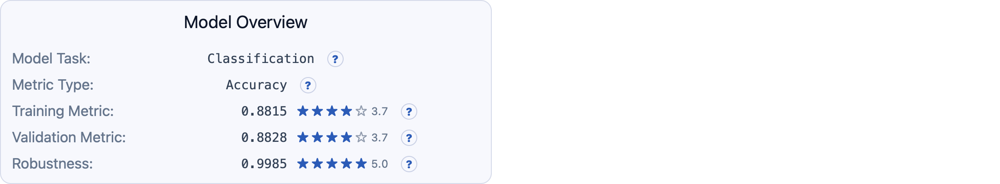
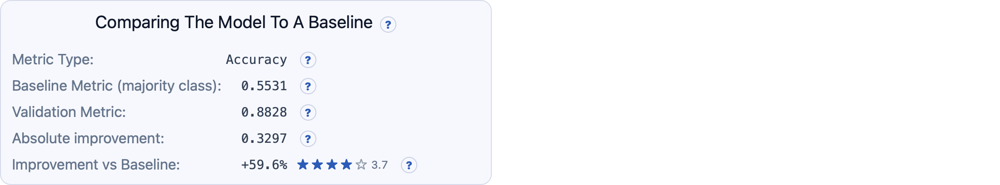
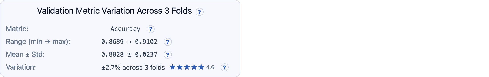
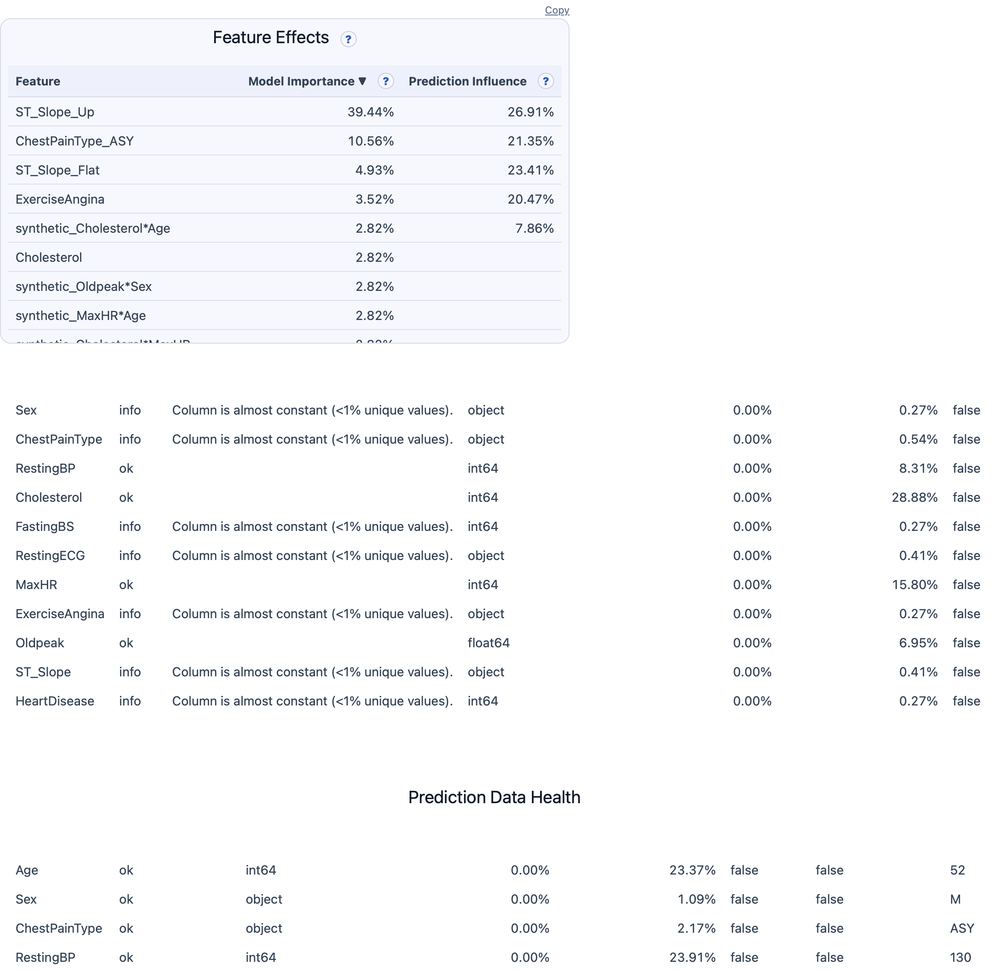
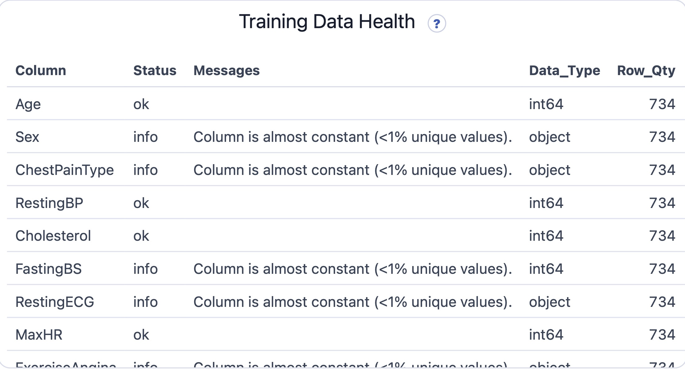
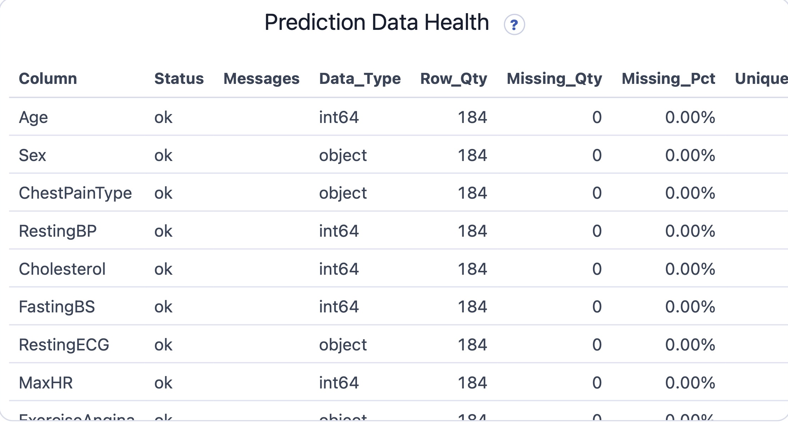
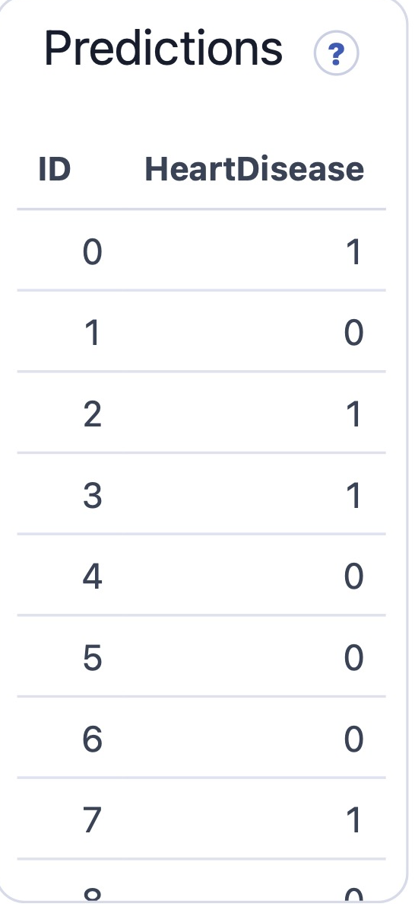

# Predictly (https://predictly.cloud)

## Predictly at a glance

- Upload your tabular data
- Choose what you want to predict
- Get solid predictions and analytics in minutes

---

## What Predictly does

Predictly implements the most common tabular prediction tasks:

- **Regression** — predicting a number
- **Binary Classification** — predicting 2 categories like True/False
- **Multiclass Classification** — predicting from many categories like A/B/C

Predictly works with **tabular data**, the kind found in CSV files and spreadsheets:

- Each row represents one sample (e.g. a house or a customer)
- Each column represents a feature
- One column is the target — the value that you want Predictly to predict

---

## Who is Predictly for?

Predictly is designed for:

- Product and operations teams who want to test out ideas
- Engineers who want to prototype and get fast, solid results
- Anyone who wants predictions and analytics without coding

It is especially useful when:

- You want results quickly
- You value consistency and reliability
- You want transparency instead of black boxes

---

## What Predictly is not

Predictly does not try to be everything.

- It is not a deep-learning research platform
- It is not optimized for large datasets
- It is not a replacement for custom ML engineering

Predictly focuses on the most common, practical tabular problems — and does them well.

---

## Designed for simplicity

Predictly is intentionally simple. Rather than exposing multiple tuning knobs, it focuses on:

- Sensible defaults
- Clear steps
- Strong validation

This makes it easy to get useful results without needing to be a machine-learning expert.

---

## Predictly, behind the scenes

- Flags and imputes missing values
- Reduces the impact of outliers
- Generates polynomial features from high-impact features
- Encodes and scales features automatically
- Balances model complexity to avoid underfitting and overfitting

---

## Out-of-Fold validation

Predictly evaluates models using **out-of-fold (OOF) validation**.

Your data is split into multiple parts. Models are trained on some parts and tested on others.

This provides a more realistic picture of how a model will perform on unseen data, not just the data it has already seen.

---

## Analytics

After modeling and training, Predictly shows several key outputs:

- **Training Metric** — How well the model fits the data it trained on
- **Validation Metric** — How well the model performs on unseen data
- **Robustness** — Measures how stable performance is across folds
- **Baseline Comparison** — How the model performs relative to a naive baseline
- **Model Variation** — Variation across different folds
- **Where the Model Works Best** — Performance across different segments of data
- **Feature Effects** — Which features matter and how they influence predictions
- **Data Health** — Highlights issues in your data
- **Predictions** — Final predicted values for your prediction dataset

